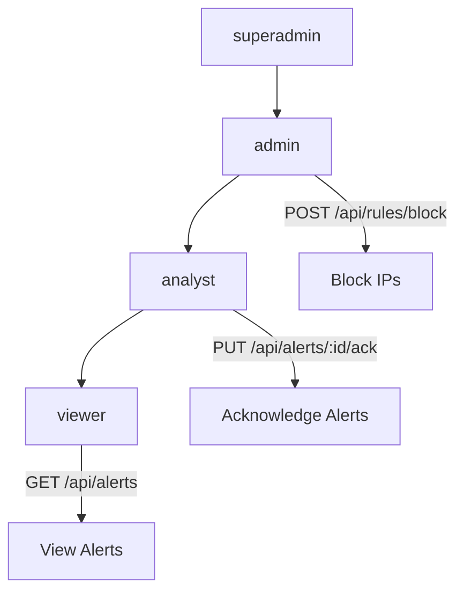
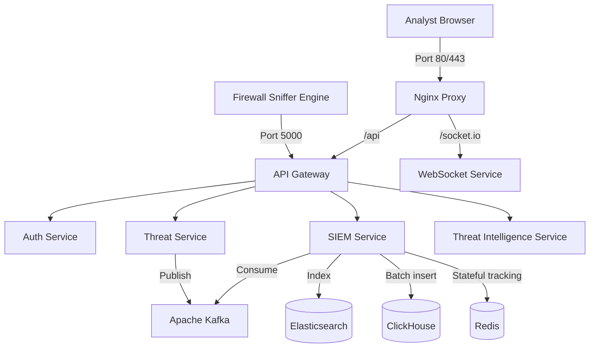

# CyberWall Neural XDR – Enterprise Readiness & Hardening Guide

This document details the production hardening, performance tuning, and enterprise security measures implemented for CyberWall Neural XDR.

---

## 1. Production Hardening Checklist

> [!IMPORTANT]
> Ensure all checklist items are audited and verified before staging and production deployment.

- [x] **Secrets Management:** Kept JWT secrets, MongoDB credentials, and external TI API keys out of source control.
- [x] **API Rate Limiting:** Granular rate limits applied. Stricter thresholds configured for authentication endpoints to prevent brute-force attacks.
- [x] **Injection Protection:** Request validation middleware active at the gateway layer to sanitize and block NoSQL/SQL injections.
- [x] **Secure WebSockets:** Handshake connections require either a valid JWT (for users) or a registered API Key (for the firewall-engine).
- [x] **Audit Logging:** Structured JSON audit logs output to `stdout` for automatic collection by Loki/Splunk/Elasticsearch.
- [x] **Container Security:** Added CPU/Memory resource limits and container-level healthchecks for auto-recovery.
- [x] **Least Privilege:** API Gateway sanitizes header attributes and routes requests with custom proxy headers (`X-User-Id`, `X-User-Role`).

---

## 2. Security Review & RBAC Architecture

### Hierarchical Role-Based Access Control (RBAC)

The auth middleware implements a strict hierarchical RBAC system allowing permissions to inherit downwards:
*   `superadmin` (inherits all permissions)
*   `admin` (inherits admin, analyst, viewer permissions)
*   `analyst` (inherits analyst, viewer permissions)
*   `viewer` (read-only access)



### Gateway Injection Validation & Rate-Limiting

The gateway enforces the following mitigations:
- **Rate-Limiter:** Stricter rate-limiting (20 requests per 15 minutes) applied to `/api/auth/login` and `/api/auth/register` to block automated brute-forcing.
- **SQLi & NoSQLi Protection:** Incoming request body and parameters are evaluated against active regex signatures (e.g. `$gt`, `$ne`, `UNION SELECT`) to drop injection attacks at the edge.

---

## 3. Performance Optimization Report

### Columnar ClickHouse Analytics
- **Aggregation Acceleration:** ClickHouse columnar schema groups packet sizes and protocol records into sub-millisecond aggregations.
- **Batched Ingestion:** Ingestion worker caches raw traffic telemetry and writes in bulk batches of 100 entries, saving disk I/O and clickhouse resource usage.

### Elasticsearch Search Optimization
- **Incident Querying:** Dedicated indexes defined with optimal tokenizers on keywords like `sourceIp`, `destIp`, and `mitreId` for instant, paginated text searches.
- **Fail-Open Design:** Search API degrades gracefully returning MongoDB fallback if the Elasticsearch node experiences downtime.

---

## 4. Scalability Improvements

### WebSocket and Messaging Tuning
- **Redis Event Broker:** Socket.IO instances share state via Redis Pub/Sub, facilitating horizontal scaling of WebSocket nodes behind load balancers.
- **Kafka Log Queueing:** Event pipelines stream traffic logs through Kafka, buffering traffic spikes without causing microservice memory exhaustion.

```
Incoming Traffic Batches ──> Kafka Broker (Topic: cyberwall-traffic) ──> Ingest Workers ──> ClickHouse Batch Ingestion
```

---

## 5. Monitoring & Reliability Strategy

### Auto Recovery & Health Checks
- **Health Checks:** Every service includes container-level health checks using HTTP or Shell calls (`/health`), enabling Kubernetes / Docker Engine to recycle degraded containers.
- **Structured Alerting:** Prometheus configuration monitors request latencies, and Grafana maps throughput trends.

---

## 6. Final Deployment Architecture

The hardened deployment architecture separates public facing components, API gateways, storage engines, and internal analysis workers.


